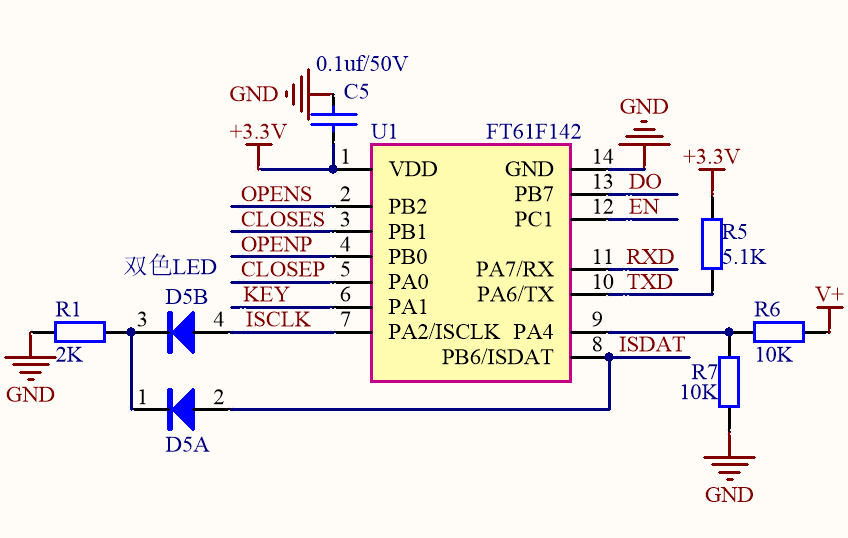

## 底层封装:

1. PA2,PA4两个LED灯,分别为LED1,LED2
2. PA6,PA7两个是UART引脚
3. PA1按键控制
4. PB2,PB1是电机转动引脚
5. PB0,PA0是如果电机转动到位了,这两个引脚会被拉低,然后关电机
6. 两个UART引脚和PC1EN引脚是用来跟WiFi模块对话的
7. PB7会接收到433信号,需要"D:\information\circuit_board\nanjing_hosptial\泄露报警\英芯泰资料\英芯泰资料\main接收.c"用这里的算法去接收信号

把引脚定义装到数据链路层的文件里

## 数据链路层


### 433接收函数

[接收例程1]() "D:\information\circuit_board\nanjing_hosptial\泄露报警\英芯泰资料\英芯泰资料\main接收.c"

[接受例程2]() "D:\information\circuit_board\nanjing_hosptial\泄露报警\英芯泰资料\英芯泰资料\main54接收.c"


```
//************433数据定义区**********//
__at(0x20) unsigned char flag = 0;
__sbit bit_rf_ok      = flag:0;               //第一次遥控编码赋值成功
__sbit bit_last_state = flag:1;               //上一个编码，0为低，1为高
__sbit bit_syn        = flag:2;               //同步码标志位，置1表示已经收到同步码，置0表示未收到同步码
__sbit bit_BEEP       = flag:3;               //蜂鸣器标志位，0蜂鸣器不响，1蜂鸣器响
//第一次遥控编码
__at(0x21) unsigned char a_code1;
__at(0x22) unsigned char a_code2;
__at(0x23) unsigned char a_code3;
//高低电平宽度
__at(0x24) unsigned char hh_w;
__at(0x25) unsigned char ll_w;
//临时遥控编码
__at(0x26) unsigned char t_code1;
__at(0x27) unsigned char t_code2;
__at(0x28) unsigned char t_code3;
__at(0x29) unsigned char  ma_x;                     //接收到第几位编码
unsigned int s;                          // 收到第一个码和第二个码之间不能超过s个周期
unsigned char rf_data[3];                //最后收到的遥控编码
unsigned char buff[3];                   //存的用户码
//*************************************************************//
```


```
PCON1 = C_TMR0_Dis;			
TMR0 = 169;				
T0MD = C_PS0_TMR0 | C_PS0_Div8;
INTE = C_INT_TMR0 ;
PCON = C_WDT_En | C_LVR_En;
PCON1 = C_TMR0_En;		
INTF = 0;				
ENI();
```

**接收**

```
void isr(void) __interrupt(0)
{
    // 定时器 T0 中断，周期 90us
    if (INTFbits.T0IF)   
    {
        // ========================================================
        // 1. 记录高低电平的持续时间 (脉宽检测)
        // ========================================================
  
        // 接收到低电平：低电平计数器(ll_w)自加，标记当前状态为低
        if (PORTBbits.PB7 == 0)  // 
        {
            ll_w++;   
            bit_last_state = 0;
        }
        // 接收到高电平：高电平计数器(hh_w)自加
        else
        {
            hh_w++;
  
            // 检测到上升沿 (即上一状态为低电平，当前为高电平)
            // 所有的同步码和数据位的最后都是由低变高
            if (!bit_last_state)  
            {   
                // ------------------------------------------------
                // 状态机 A：寻找同步码
                // ------------------------------------------------
                if ((hh_w >= 2 && hh_w <= 5) && (ll_w >= 90 && ll_w <= 140))
                { 
                    bit_syn = 1;     // 确认收到同步码，标志置 1
                    ma_x = 0;        // 接收位数清零
                    t_code1 = 0;     // 清空临时编码变量
                    t_code2 = 0; 
                    t_code3 = 0; 
                }
  
                // ------------------------------------------------
                // 状态机 B：已收到同步码，正在接收数据位【逻辑 0】
                // 逻辑 1 的特征：低电平宽度在 7~13 之间
                // ------------------------------------------------
                else if (bit_syn && (ll_w >= 7 && ll_w <= 13))
                {
                    ma_x++; 
  
                    // 如果已经接收满 24 位码 (ma_x > 23)
                    if (ma_x > 23)
                    {
                        if (!bit_rf_ok)
                        { 
                            // 将临时编码转存到结果变量中
                            a_code1 = t_code1;
                            a_code2 = t_code2;
                            a_code3 = t_code3;		
      
                            bit_rf_ok = 1;     // 标记解码成功	
                            bit_syn = 0;       // 清除同步标志，准备下一次接收
                            s = 1000;          // 开始单重认证计时
                        }
                    }
                }  
  
                // ------------------------------------------------
                // 状态机 C：已收到同步码，正在接收数据位【逻辑 1】
                // 逻辑 0 的特征：低电平宽度在 2~7 之间
                // ------------------------------------------------
                else if (bit_syn && (ll_w >= 2 && ll_w <= 7))
                {
                    // 根据当前是第几位，将对应的数据位置 1
                    switch (ma_x)
                    { 
                        case 0:  t_code1 |= 0x80; break; 
                        case 1:  t_code1 |= 0x40; break; 
                        case 2:  t_code1 |= 0x20; break; 
                        case 3:  t_code1 |= 0x10; break; 
                        case 4:  t_code1 |= 0x08; break; 
                        case 5:  t_code1 |= 0x04; break; 
                        case 6:  t_code1 |= 0x02; break; 
                        case 7:  t_code1 |= 0x01; break; 
  
                        case 8:  t_code2 |= 0x80; break; 
                        case 9:  t_code2 |= 0x40; break; 
                        case 10: t_code2 |= 0x20; break; 
                        case 11: t_code2 |= 0x10; break; 
                        case 12: t_code2 |= 0x08; break; 
                        case 13: t_code2 |= 0x04; break; 
                        case 14: t_code2 |= 0x02; break; 
                        case 15: t_code2 |= 0x01; break; 
  
                        case 16: t_code3 |= 0x80; break; 
                        case 17: t_code3 |= 0x40; break; 
                        case 18: t_code3 |= 0x20; break; 
                        case 19: t_code3 |= 0x10; break; 
                        case 20: t_code3 |= 0x08; break; 
                        case 21: t_code3 |= 0x04; break; 
                        case 22: t_code3 |= 0x02; break; 
                        case 23: 
                            t_code3 |= 0x01;  
                            if (!bit_rf_ok)
                            {
                                a_code1 = t_code1;
                                a_code2 = t_code2;
                                a_code3 = t_code3;		
          
                                bit_rf_ok = 1; 	
                                bit_syn = 0; 
                                s = 1000;
                            }
                            break;
                    } 
                    ma_x++;
                }
  
                // ------------------------------------------------
                // 状态机 D：干扰数据或格式错误，重置接收机
                // ------------------------------------------------
                else
                { 
                    ma_x = 0; 
                    bit_syn = 0;
                    t_code1 = 0;
                    t_code2 = 0;
                    t_code3 = 0;
                    ll_w = 0;
                }              
  
                // 每次上升沿处理完毕后，低电平计数清零，高电平重新从1开始算
                ll_w = 0;
                hh_w = 1; 
            }  
            bit_last_state = 1;
        }
  
        // ========================================================
        // 2. 单重认证防误触倒计时 (超时则判定数据无效)
        // ========================================================
        if (bit_rf_ok)  
        {
            s--;
            if (!s) 
            {
                bit_rf_ok = 0;
            }
  
            // 实时将解码结果抛给主程序处理
            rf_data[0] = a_code1;
            rf_data[1] = a_code2;
            rf_data[2] = a_code3;
        }
 
        // ========================================================
        // 3. 重置定时器并清除中断标志
        // ========================================================
        TMR0 = 169;  
        INTF = (unsigned char)~(C_INT_TMR0); // Clear T0IF flag bit
    }
}
```


### WIFI发送接收函数

### 电机驱动

```
#define PB2 OPENS
#define PB1 CLOSES
#define PB0 OPENP
#define PA0 CLOSEP
void motor_running_open(void){    OPENS=1;    CLOSES=0;}
void motor_running_close(void){    OPENS=0;    CLOSES=1;}
void motor_stop(void){    OPENS=0;    CLOSES=0;}
```


**C**

```
#ifndef __MOTOR_DRIVER_H
#define __MOTOR_DRIVER_H

#include <stdint.h>

#define MOTOR_MAX_RUN_MS  5000  // 5秒超时时间 (卡住判断)

// 1. 阀门的真实物理状态
typedef enum {
    MOTOR_ST_UNKNOWN = 0, // 刚上电未校准 (既不在开到位，也不在关到位)
    MOTOR_ST_OPENED,      // 开到位
    MOTOR_ST_CLOSED,      // 关到位
    MOTOR_ST_OPENING,     // 运行状态：正在开
    MOTOR_ST_CLOSING,     // 运行状态：正在关
    MOTOR_ST_JAMMED       // 卡住状态 (报警)
} MotorState_t;

// 2. 电机对象结构体
typedef struct {
    // ---- 物理状态 ----
    MotorState_t current_state; 
    uint16_t     running_ms;     // 运行时间计数器
  
    // ---- 底层控制指针 (插头) ----
    void (*hw_open)(void);
    void (*hw_close)(void);
    void (*hw_stop)(void);
  
    // ---- 向上层报警的回调 (打小报告) ----
    void (*on_jammed_error)(void); // 卡住时触发
    void (*on_arrived)(void);      // 正常到位时触发 (可选)
} Motor_Obj_t;

// 3. 暴露的 API
void Motor_Init(Motor_Obj_t *motor, 
                void (*hw_open)(void), void (*hw_close)(void), void (*hw_stop)(void),
                void (*on_error)(void), void (*on_arrived)(void));

void Motor_Open(Motor_Obj_t *motor);
void Motor_Close(Motor_Obj_t *motor);

//外部通知电机“你已经到位了” (比如限位开关触发时调用)
void Motor_Arrived(Motor_Obj_t *motor); 

//强制停止并解除报警 (复位用)
void Motor_Stop_And_Clear(Motor_Obj_t *motor);

void Motor_Timer_Task(Motor_Obj_t *motor) ;

#endif
```


**C**

```
#include "motor_driver.h"
#include <stddef.h>

void Motor_Init(Motor_Obj_t *motor, 
                void (*hw_open)(void), void (*hw_close)(void), void (*hw_stop)(void),
                void (*on_error)(void), void (*on_arrived)(void)) 
{
    if (!motor) return;
  
    motor->current_state = MOTOR_ST_UNKNOWN; // 上电默认未知
    motor->running_ms    = 0;
  
    motor->hw_open  = hw_open;
    motor->hw_close = hw_close;
    motor->hw_stop  = hw_stop;
    motor->on_jammed_error = on_error;
    motor->on_arrived      = on_arrived;
  
    if (motor->hw_stop) motor->hw_stop();
}

void Motor_Open(Motor_Obj_t *motor) 
{
    if (!motor) return;
    // 如果已经开到位了，直接忽略 (防止重复驱动)
    if (motor->current_state == MOTOR_ST_OPENED) return; 

    motor->current_state = MOTOR_ST_OPENING;
    motor->running_ms    = 0;
    if (motor->hw_open) motor->hw_open();
}

void Motor_Close(Motor_Obj_t *motor) 
{
    if (!motor) return;
    // 如果已经关到位了，直接忽略
    if (motor->current_state == MOTOR_ST_CLOSED) return;

    motor->current_state = MOTOR_ST_CLOSING;
    motor->running_ms    = 0;
    if (motor->hw_close) motor->hw_close();
}

// ==========================================
// 核心接口：外部通知电机已到位 (正常停止)
// ==========================================
void Motor_Arrived(Motor_Obj_t *motor) 
{
    if (!motor) return;
  
    // 1. 立刻切断硬件电源
    if (motor->hw_stop) motor->hw_stop();
  
    // 2. 根据之前的运行方向，结算最终状态
    if (motor->current_state == MOTOR_ST_OPENING) {
        motor->current_state = MOTOR_ST_OPENED; // 结算为：开到位
    } 
    else if (motor->current_state == MOTOR_ST_CLOSING) {
        motor->current_state = MOTOR_ST_CLOSED; // 结算为：关到位
    }
  
    motor->running_ms = 0;
  
    // 3. 通知上层业务 (如果需要的话)
    if (motor->on_arrived) motor->on_arrived();
}

// 手动强制停止 (用于清除卡住报警)
void Motor_Stop_And_Clear(Motor_Obj_t *motor)
{
    if (!motor) return;
    if (motor->hw_stop) motor->hw_stop();
    motor->current_state = MOTOR_ST_UNKNOWN; // 被中途强停，位置变回未知
    motor->running_ms = 0;
}

/**
 * @brief 电机定时器处理函数 (放在中断ISR中)
 * @note  按照要求：无消抖、先判断运行状态、后处理计时与到位/超时
 */
void Motor_Timer_Task(Motor_Obj_t *motor) 
{
    // 1. 首先判断是否处于运行状态 (Opening 或 Closing)
    // 如果电机没在动，直接返回，不浪费 CPU 资源
    if (!(motor->current_state == MOTOR_ST_OPENING || 
          motor->current_state == MOTOR_ST_CLOSING)) 
    {
        return;
    }

    // 2. 运行计时自增
    motor->running_ms++;

    // 3. 到位检测 (无消抖，只要引脚为0即判定到位)
    // 注意：Motor_Arrived 内部会根据 current_state 自动判断是 OPENED 还是 CLOSED
    if (OPENP == 0 || CLOSEP == 0) 
    {
        Motor_Arrived(motor);
    }
    // 4. 如果没到位，则判断是否运行超时 (卡住)
    else if (motor->running_ms >= MOTOR_MAX_RUN_MS) 
    {
        // 停止电机并清除状态 (变为 UNKNOWN)
        Motor_Stop_And_Clear(motor);
      
        // 执行卡死回调报警
        if (motor->on_jammed_error) 
        {
            motor->on_jammed_error();
        }
    }
}
```


### LEDblingbling


#### 🔴面向对象写法

```
// led_driver.h
typedef struct {
    // 对象的“属性” 
    uint16_t remain_blink_ms;
    uint16_t toggle_tick;
    uint16_t blink_interval_ms;
  
    // 对象的“底层方法” 
    void (*hw_on)(void);
    void (*hw_off)(void);
    void (*hw_toggle)(void);//hw 是 Hardware的意思
} LED_Obj_t;

// 暴露给外部的 API，第一个参数永远是“对象句柄”
void LED_Init(LED_Obj_t *led, void (*on)(void), void (*off)(void), void (*toggle)(void));
void LED_StartBlink(LED_Obj_t *led, uint16_t total_ms, uint16_t interval_ms);
void LED_Process_1ms(LED_Obj_t *led);
```

在 `LED_Init` 函数里，我们要把上面这些函数的**地址**赋给结构体里的指针。

```
void LED_Init(LED_Obj_t *led, void (*on)(void), void (*off)(void), void (*toggle)(void)) {
    led->remain_blink_ms = 0;
    led->toggle_tick = 0;
  
    // 关键：把函数地址存起来
    led->hw_on = on;
    led->hw_off = off;
    led->hw_toggle = toggle;
  
    // 初始化时默认关灯
    if(led->hw_off) led->hw_off();
}

// 在 main.c 里调用：
LED_Obj_t running_led;
LED_Init(&running_led, stm32_led_on, stm32_led_off, stm32_led_toggle);
```

中断里调用

```
void LED_Process(LED_Obj_t *led) {
    if (led->remain_blink_ms > 0) {
        led->remain_blink_ms--;
  
        led->toggle_tick++;
        if (led->toggle_tick >= led->blink_interval_ms) {
            led->toggle_tick = 0;
  
            //这里和下面的if防止野指针
            if(led->hw_toggle) {
                led->hw_toggle(); 
            }
        }
  
        if (led->remain_blink_ms == 0) {
            if(led->hw_off) led->hw_off(); // 结束时强制关灯
	    led->toggle_tick = 0;
        }
    }
}
```

想要闪烁的话就要

```
LED_StartBlink(&led,3000,50);//闪烁3S,频率是50ms反转一次
```

开关的函数:

```
// 注意看参数：只需要传对象指针，不需要传底层硬件函数了！
void LED_On(LED_Obj_t *led) 
{
    if (led == NULL) return; // 防御性保护

    // 1. 清除闪烁状态（强制常亮）
    led->remain_blink_ms = 0; 
  
    // 2. 直接呼叫对象内部“记忆”的底层函数
    if (led->hw_on) {
        led->hw_on(); 
    }
}

// 同理，关灯也是极简的
void LED_Off(LED_Obj_t *led) 
{
    if (led == NULL) return;
    led->remain_blink_ms = 0; 
    if (led->hw_off) {
        led->hw_off(); 
    }
}
```


## 应用层:

不需要持续,无复杂事件,用表驱法

### 先枚举一下状态:平时就RUNNING状态,没电了就ERROR状态

```
typedef enum {
    STATE_IDLE,
    STATE_RUNNING,//平时无事件运行
    STATE_ERROR,//BUG状态
    STATE_MOTOR_RUN,//电机正在动
    STATE_433_duima//正在对码等待中
} SystemState;
SystemState currentState = STATE_IDLE;
```

### 再枚举一下事件

```
typedef enum {
    EV_NONE = 0,//无事件
    EV_START,//开始运行
    EV_WIFI_OPEN,//WIFI传来信息,要开阀
    EV_WIFI_CLOSE,//WIFI传来信息,要关阀
    EV_WIFI_RESET,//WIFI强制复位
    EV_433_LEAK,//漏水了,要关阀
    EV_CUTOFF,//断电了,要关阀
    EV_MOTOR_OVER,//阀门到位了,停止电机
    EV_LONG_KEY,//按钮长按了,要对码
    EV_SHORT_KEY,//按钮短按,开关阀切换,环形写入EEPROM存储记忆
    EV_433_duima,//结束到对码帧,保存到变量和EEPROM
    EV_TIM_5S_OVER,//超时5秒
    EV_TIN_10S_OVER,//超时10秒
   } SystemEvent;
SystemEvent currentEvent = EVENT_IDLE;
```

### 表驱法格式:

```
// 表结构
typedef struct {
    SystemState current;  // 当前状态
    SystemEvent event;    // 触发事件
    SystemState next;     // 下一状态
    void (*action)(void); // 执行的操作
} Transition;

// 状态转移表
Transition transitions[] = {
    // ---- 系统启动 ----
    {STATE_IDLE,       EV_START,        STATE_RUNNING,   start_running},
  
    // ---- 正常待机状态 ----
    {STATE_RUNNING,    EV_WIFI_OPEN,    STATE_MOTOR_RUN, motor_running_open},
    {STATE_RUNNING,    EV_WIFI_CLOSE,   STATE_MOTOR_RUN, motor_running_close},
    {STATE_RUNNING,    EV_433_LEAK,     STATE_MOTOR_RUN, motor_running_close},
    {STATE_RUNNING,    EV_CUTOFF,       STATE_MOTOR_RUN, motor_running_close},
    {STATE_RUNNING,    EV_LONG_KEY,     STATE_433_duima, 0},
    {STATE_RUNNING,    EV_SHORT_KEY,    STATE_MOTOR_RUN, motor_toggle}, 
  
    // ---- 电机运动状态 ----
    {STATE_MOTOR_RUN,  EV_MOTOR_OVER,   STATE_RUNNING,   motor_stop},
    {STATE_MOTOR_RUN,  EV_TIM_5S_OVER,  STATE_ERROR,     motor_stop},
    {STATE_MOTOR_RUN,  EV_CUTOFF,       STATE_MOTOR_RUN, motor_running_close},
    {STATE_MOTOR_RUN,  EV_433_LEAK,     STATE_MOTOR_RUN, motor_running_close},
  
    // ---- 对码状态 ----
    {STATE_433_duima,  EV_TIN_10S_OVER, STATE_RUNNING,   0},
    {STATE_433_duima,  EV_433_duima,    STATE_RUNNING,   write_eeprom_address},
  
    // ---- 错误状态处理  ----
    {STATE_ERROR,      EV_SHORT_KEY,    STATE_RUNNING,   0},
    {STATE_ERROR,      EV_WIFI_RESET,    STATE_RUNNING,   0} 
};

void process_event(SystemEvent event) {
    int size = sizeof(transitions) / sizeof(Transition);
    for (int i = 0; i < size; i++) {
        if (transitions[i].current == current_state && transitions[i].event == event) {
            current_state = transitions[i].next;
            if (transitions[i].action) transitions[i].action();
            return;
        }
    }
    invalid_transition(); // 没找到就报个错 (或者静默忽略)
}

int main()
{
    // ... 硬件初始化代码 (GPIO, UART, Timer等) ...
  
    // 嵌入式标准死循环
    while(1)
    {
        // 判断是否有有效事件产生
        if(currentEvent != EV_NONE)
        {
            // 暂存事件
            SystemEvent temp_evt = currentEvent;
            // 清除事件标志，防止同一个事件被处理多次，也允许中断继续写入新事件
            currentEvent = EV_NONE; 
  
            // 查状态机表，执行动作
            process_event(temp_evt); 
        }
  
        // 可以在这里放喂狗程序、延时调度等
    }
}
```
